<table>
  <tr>
    <td>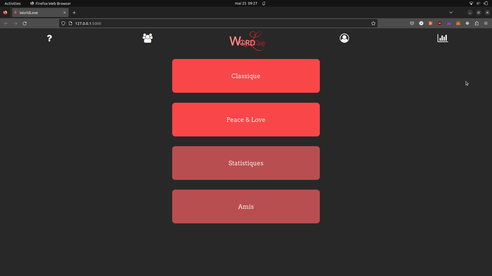</td>
    <td>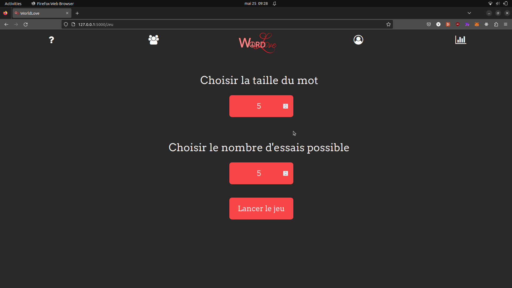</td>
    <td>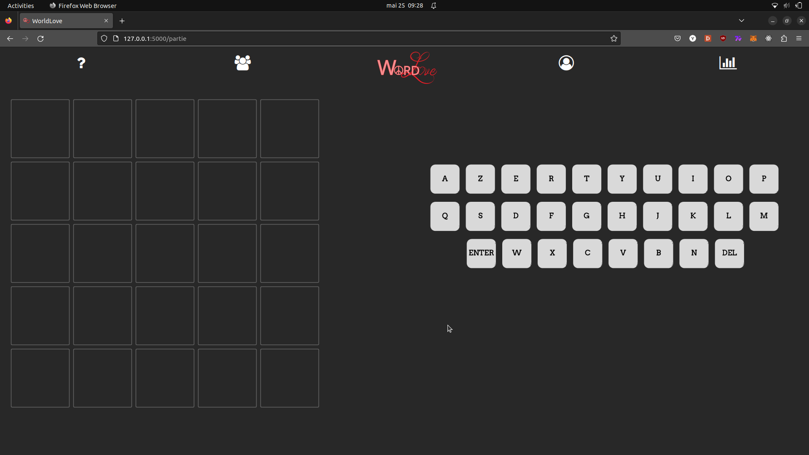</td>
    <td>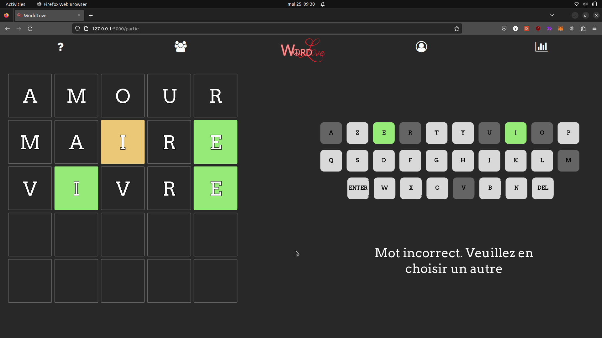</td>
  </tr>
  <tr>
    <td>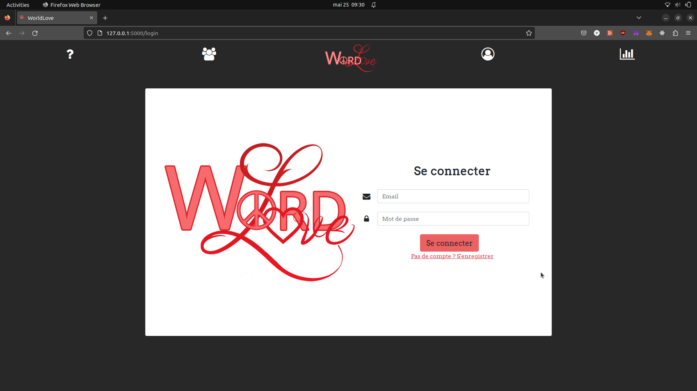</td>
    <td>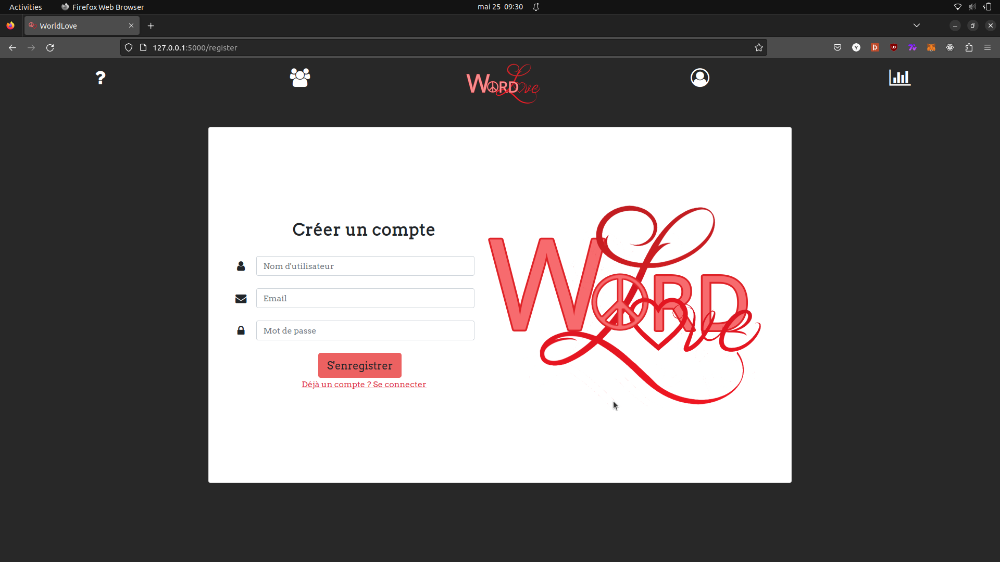</td>
    <td>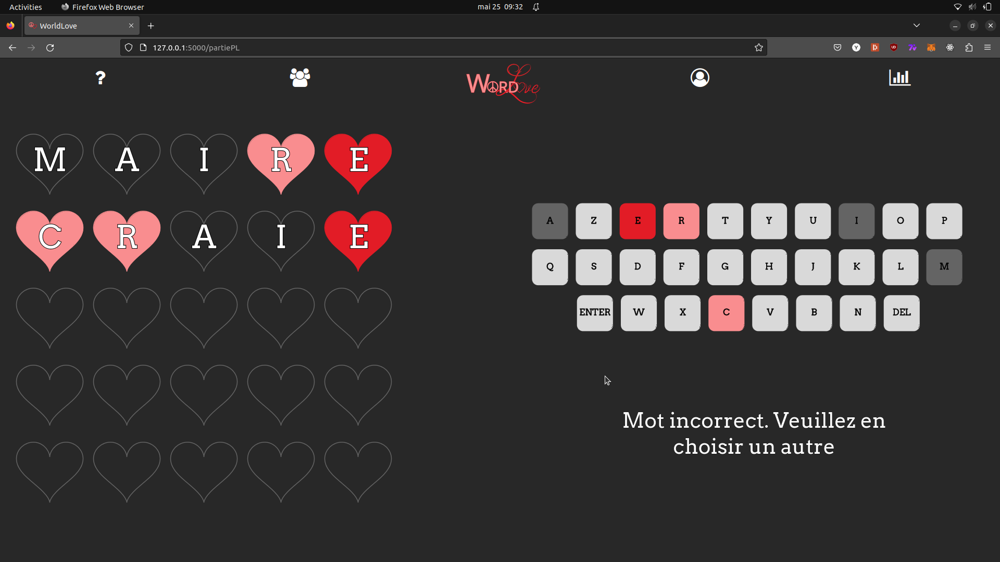</td>
    <td>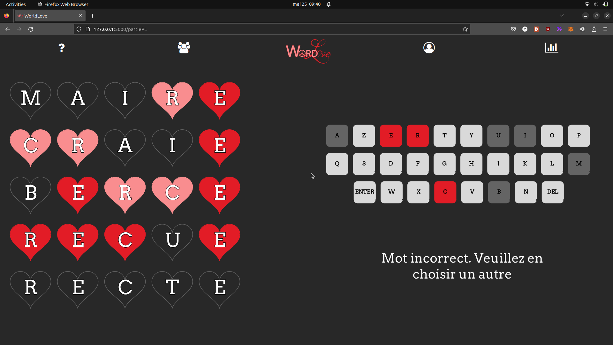</td>
  </tr>
  <tr>
    <td>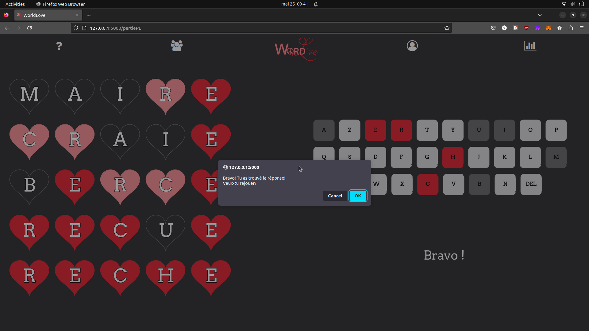</td>
    <td>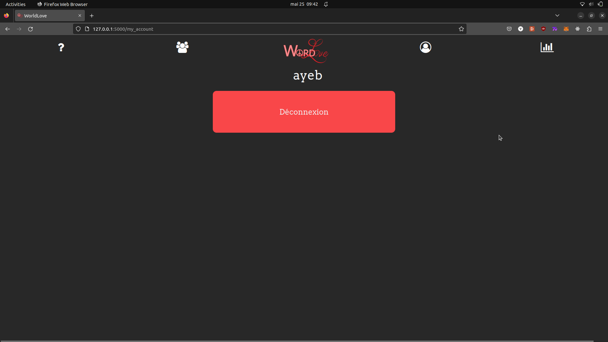</td>
    <td>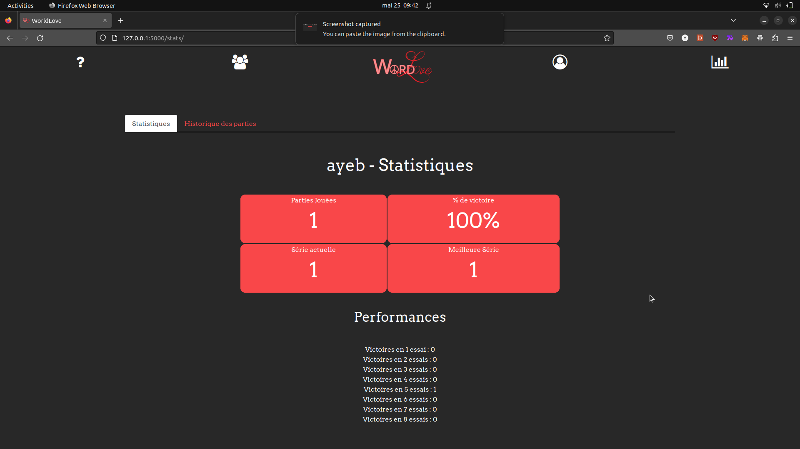</td>
    <td>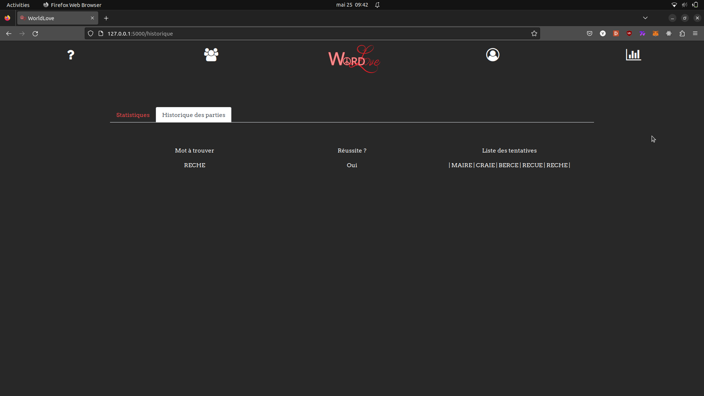</td>
  </tr>
  <tr>
    <td>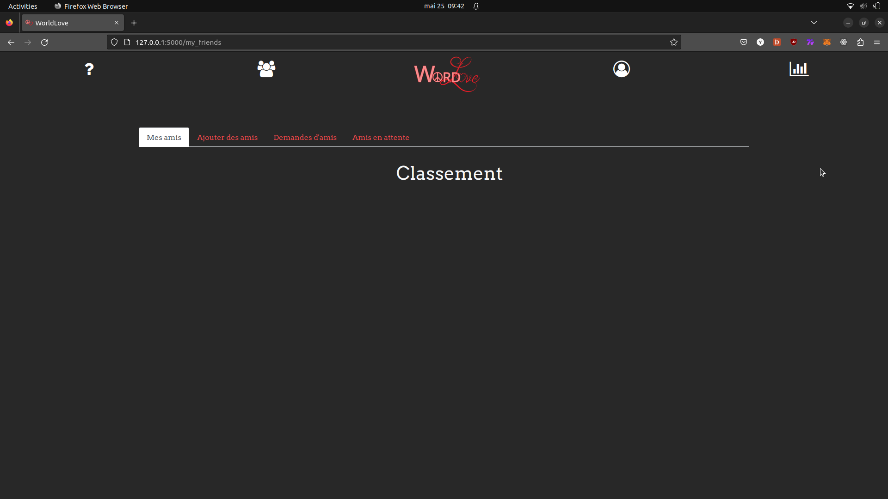</td>
  </tr>
  
</table>

# PPII «Projet Pluridisciplinaire d'Informatique Intégrative» 2 (2021-2022)

Olivier Festor <<olivier.festor@telecomnancy.eu>>  
Gérald Oster <<gerald.oster@telecomnancy.eu>>  

## Wordle - Solveur de Wordle

[Le sujet détaillé en version PDF](./Projet_P2I2_S2_2122_DP.pdf)

**Membres du groupe** :  

* SERRAND Coralie <coralie.serrand@telecomnancy.eu>
* TEJEDOR Manon <manon.tejedor@telecomnancy.eu>
* THEISSE Alexandre <alexandre.theisse@telecomnancy.eu>
* YEBOUET Antoine <antoine.yebouet@telecomnancy.eu>

## **Description du projet**
Le but de ce projet a été de réaliser dans un premier une application web Wordle.
Dans un second temps il s'agissait de la conception d'un solveur de Wordle correspondant à notre application.

## **Application web Wordlove**
* 2 Modes de jeu : Classique et Peace&Love
* Statistiques : Historique des parties et performance générale
* Création de compte, amis

**Lancement rapide du wordle**

A faire après le clonage, dans un premier terminal :

```bash
cd project2-E8
python3 -m venv env
source env/bin/activate
pip install -r requirements.txt
python3 Wordle/app.py
```

## **Solveur Wordle**
* Résolution pour un [dictionnaire](./Solveur/liste_78k.txt) de 78k mots
* Taille des mots : de 4 à 8 lettres

**Consignes d'utilisation**

* Entrer la taille du mot dans le fichier [wsolf.txt](./Solveur/wsolf.txt) avant de lancement (respecter la taille)
* Entrer en ligne de commande au début le nombre d'essais, puis les résultats des mots proposés par le solveur. Les résultats doivent être de la forme xxx où il y'a autant de x que la taille du mot et où x vaut 0,1, ou 2. Un 0 représente un lettre qui n'est pas dans le mot, un 1 une lettre mal placée dans le mot, et un 2 une lettre bien placée. Bien veiller à respecter la taille. Le solveur proposera ensuite un autre mot .En cas d'erreur faire Ctrl+C .

**Lancement rapide du solveur**

A faire après le clonage, dans un deuxième terminal :

```bash
cd project2-E8/Solveur/src
make solveur_main_test
```
